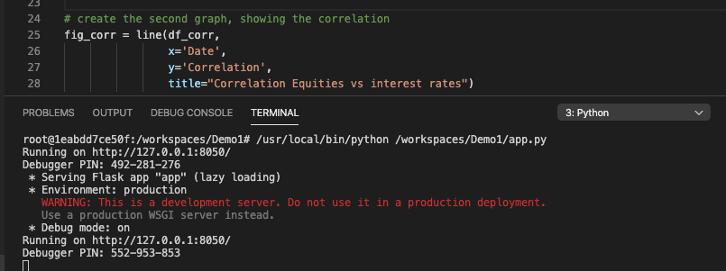

Find the source code of the dashboard on my Github page

Dashboards are great instruments tools to get a quick understanding of a certain subject, for instance financial markets. Building and maintaining **effective** dashboards can be challenging:

1. First, there is the process of gathering the data sources and transforming in an appropriate format (the so-called Extract-Transform-Load, or [ETL](https://en.wikipedia.org/wiki/Extract,_transform,_load));
2. Secondly there is the art of constructing the dashboard in such a way that it visually informs the end-user most effectively, considering mobile devices as well;
3. And finally, one needs to consider how to keep to dashboard up-to-date, using minimal, if none, manual interaction (straight through process). In my opinion, there is nothing more frustrating than updating the underlying dataset manually each time before sharing the updated dashboard to the end-user.

In this article, I present a solution for the second bullet point , by building a fairly basic dashboard using the open-source solution [Dash by Plot.ly](https://plot.ly/dash/). Dash offers beautiful interactive and scalable dashboards. The dashboard discussed here presents two key risk and performance drivers for a asset manager: the global equity market and the 30 year EUR interest rate. Two graphs are presented: one which shows the prices of the two drivers during 2019, and the second showing the 30 days rolling window correlation.

For those only interested in the end result, you can find a demo of the dashboard [here](https://dashboards.datarush.nl/demo1).

## How to build

First, a Python development environment needs to be installed and available. There is a lot of information available on the Internet how to setup a Python environment on the operating system of your choice. A very popular platform is [Anaconda](https://www.anaconda.com/distribution/), which I recommend to use. For this blog, I use Python version 3.7.4.

Next, in order to use Dash, several packages need to be installed. Within the virtual environment of your choice, please [install](https://packaging.python.org/tutorials/installing-packages/) the following packages:

```
pip install dash==1.8.0
pip install plotly-express==0.4.1
```

For this demo, I prepared a dataset containing the price of a global equity index and the 30-year EUR interest swap rate (EUSA30). Please download the dataset here and place the file in the same folder as your upcoming Python script.

After successful installation of the aforementioned packages, please go to your [IDE](https://en.wikipedia.org/wiki/Integrated_development_environment) of choice, for instance [Visual Studio Code](https://code.visualstudio.com/docs/languages/python). Create a new file, called app.py and enter the following code:

```
import dash
import dash_core_components as dcc
import dash_bootstrap_components as dbc
from plotly_express import line
from plotly.subplots import make_subplots
import pandas as pd


# load the dataset, ignoring empty datapoints
df = pd.read_csv("marketdata.csv", index_col="Date").dropna()


# create a df with the correlations
df_corr = pd.DataFrame(df["FTSEAW"].rolling(30).corr(df["EUSA30"]))
df_corr.rename(columns={0: "Correlation"}, inplace=True)
df_corr.reset_index(inplace=True)


# make the first graph, showing the prices of the two drivers
fig = make_subplots(specs=[[{"secondary_y": True}]])
fig.add_scatter(secondary_y=False, x=df.index, y=df["FTSEAW"],
                marker_color="blue", name="FTSE All-World")
fig.add_scatter(secondary_y=True,  x=df.index, y=df["EUSA30"],
                marker_color="red", name="30Y interest rate")
fig.update_layout(title_text="Equities vs interest rates")


# create the second graph, showing the correlation
fig_corr = line(df_corr,
                x='Date',
                y='Correlation',
                title="Correlation Equities vs interest rates")


# set up the server, using a bootstrap theme
dash_app = dash.Dash(__name__,
                     external_stylesheets=[dbc.themes.UNITED])
app = dash_app.server


# define the layout of the dashboard
dash_app.title = "Financial dashboard"
dash_app.layout = dbc.Container(
    [
        dcc.Markdown('''
        # A basic financial data dashboard using Dash!


        Just try out this *simple* dashboard! For more information, \
            please go to https://www.datarush.nl


        ***


        ### **Prices**


        Please find the prices of the FTSE All-World index (LHS) and \
            the 30 year EUR interest rate (RHS).
        '''),
        dcc.Graph(figure=fig),
        dcc.Markdown('''
        ***


        ### **Correlation**


        Please find the 30 day rolling window [correlation]\
            (https://en.wikipedia.org/wiki/Correlation_and_dependence)\
                between the FTSE All-World index and \
                    the 30 year EUR interest rate.


        Note the swings in positive and negative correlations, \
            especially the relatively large negative correlation \
                during the months June, July and August.
        '''),
        dcc.Graph(figure=fig_corr)
    ]
)


# run the dashboard
if __name__ == '__main__':
    dash_app.run_server(host="0.0.0.0",
                        debug=True)
```

Run the code and notice that a web server is built at the address http://0.0.0.0:8050. The 0.0.0.0 address, or [localhost](https://en.wikipedia.org/wiki/Localhost), refers to your computer, meaning that the dashboard is only accessible from your computer. For demo purposes this is sufficient.



Open http://0.0.0.0:8050 in your browser and see, you have just built a dashboard using only a few steps and fairly limited amount of programming code! Hope you experienced an easy drive! Please find the code of the demo at my [Github](https://github.com/jeroen84/datarush-demo1) repository here.
Follow up

In later blogs, I will highlight the other two bullet points at the beginning of the article: ETL and straight through processes.