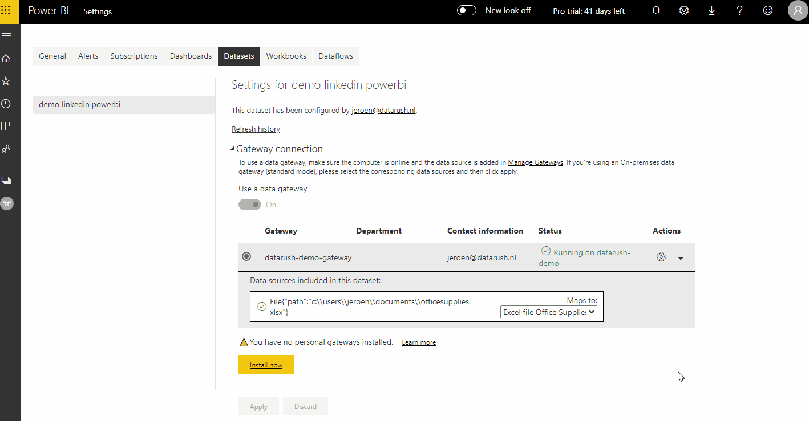

Do you update your Power BI dashboard by clicking on the Refresh button? And, subsequently, share the updated dashboard by e-mail or other communication methods with your stakeholders? If so, keep on reading!

Dashboards using tools like Power BI are great ways of exploring and visualising data, which can help in decision making processes and provide additional insights. Building a dashboard is one thing (it can be an art!), but **maintaining** and **keeping the data up-to-date** for your stakeholders can be **time consuming**. Especially when the source of the data, for example an Excel file, is changed frequently and hence your Power BI dashboard is out-of-date.

In this blog, I share with you a best practice in keeping your Power BI up-to-date with minimal, if none, manual interference. The approach leverages on the online cloud environment of Power BI, which offers the opportunity to schedule refreshes of your data sources, even if these are located on your local computer.

## 1. Starting point

As a starting point, I use a demo dashboard which can be downloaded [here](https://www.datarush.nl/datasets/OfficeSupplies.pbix). This represents a basic KPI dashboard and uses a public dataset of office supplies sales, sourced from [Kaggle](https://www.kaggle.com/ukveteran/office-supplies-time-series). I have saved the dataset as an [Excel file](https://www.datarush.nl/datasets/OfficeSupplies.xlsx) and made no further changes. The idea is that the Excel file mimics a shared document used by and edited by multiple people on a shared network drive.

## 2. Upload to the cloud

First, we need to save the dashboard in the Power BI cloud environment. Do this by clicking on the Publish button in your Power BI desktop, and select the designated workspace. Please note that a Power BI Pro license is [required](https://docs.microsoft.com/en-us/power-bi/service-admin-purchasing-power-bi-pro), although a 60-day free trial period can be obtained for you to test first.
No alt text provided for this image

## 3. Install On-Premises Gateway

Next, in order to make the automated refresh work, we need to connect the Power BI cloud to the Excel data source. Because the Excel file is on an on-premise location, we need to install the on-premises data gateway. The gateway acts as a bridge to provide quick and secure data transfer between on-premises data sources and Power BI cloud services. More information can be obtained [here](https://docs.microsoft.com/en-us/power-bi/service-gateway-onprem). To obtain and install the gateway, please go to [here](https://docs.microsoft.com/en-us/data-integration/gateway/service-gateway-install) and follow the instructions. I use the recommended gateway, not the personal mode. For the next step, I assume that you have installed the gateway successfully.

## 4. Add Excel data source to gateway

Well, if you have come to this part of the blog, then you have almost made it! What we need to do now, is connect the Excel data source to the Power BI cloud environment. To do this, go to the Settings page in the cloud environment of Power BI, then click on 'Datasets'. There you see an overview of datasets currently in your cloud environment. Next, select the dataset of your choice, and then click on the arrow of 'Gateway connection'. There you will see the gateway that you have just installed. Then, click on the right arrow in the 'Actions' of your gateway and there you see the path to the Excel sheet. Click on 'Add to gateway', and insert your credentials. After that, the data source (the Excel sheet) is now added to your gateway. The final step is to map the data source of your dataset to the gateway. Click on 'Apply' to finalize the mapping.

## 5. Schedule refreshes

The final step is then to schedule the refreshes. In the 'Datasets' window, scroll to 'Scheduled refreshes', click on the arrow, set the 'Keep your data up to date' to 'On' and set the desired frequency and time. In the example below, I have set the refresh on a daily basis at 6PM CET. Also, I have entered my e-mail address to get notified when a refresh is failed.
No alt text provided for this image

## 6. Conclusion

With only a few steps, you have transformed a rather labor intensive routine of updating your dashboards manually to a fully automated process. This blog describes a basic setup, and as the number of dashboards and data sources increase, the complexity increases. Also, the described setup requires that your desktop is available during the refresh schedules, which can be challenging in production environments.